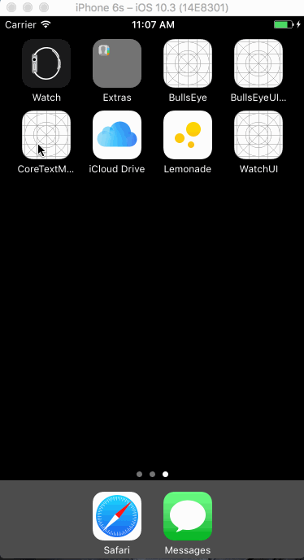

CoreTextMagazine
==========
Core Text is a low-level text engine that when used alongside the Core Graphics/Quartz framework, gives you fine-grained control over layout and formatting.

This tutorial takes you through the process of creating a very simple magazine application using Core Text… for Zombies!

## Screenshots

---
Source:

- [Core Text Tutorial for iOS: Making a Magazine App](https://www.raywenderlich.com/153591/core-text-tutorial-ios-making-magazine-app)
